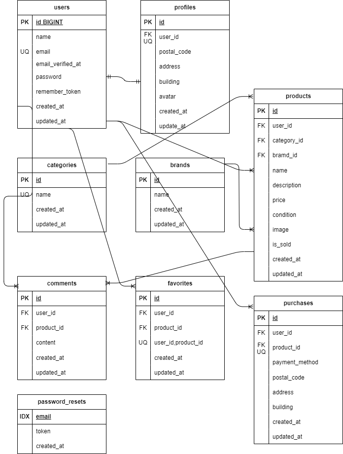

# フリマアプリ

## 概要
ユーザーが商品を出品・購入できるフリマアプリケーションです。商品の出品、お気に入り機能、コメント機能、プロフィール管理などの機能を提供します。

## 環境構築

### Dockerビルド
1. プロジェクトをクローン
```bash
git clone <repository-url>
cd furima_app/src
```

2. DockerDesktopアプリを立ち上げる

3. Dockerコンテナをビルド・起動
```bash
docker-compose up -d --build
```

> **注意**: MacのM1・M2チップのPCの場合、`no matching manifest for linux/arm64/v8 in the manifest list entries`のエラーが発生する場合があります。
> その場合は、docker-compose.ymlファイルの「mysql」内に「platform」の項目を追加してください：
> ```yaml
> mysql:
>     platform: linux/x86_64
>     image: mysql:8.0.26
>     environment:
> ```

### Laravel環境構築
1. PHPコンテナに入る
```bash
docker-compose exec php bash
```

2. 依存関係をインストール
```bash
composer install
```

3. 環境設定ファイルを作成
```bash
cp .env.example .env
```

4. .envファイルに以下の環境変数を設定
```text
DB_CONNECTION=mysql
DB_HOST=mysql
DB_PORT=3306
DB_DATABASE=laravel_db
DB_USERNAME=laranel_user
DB_PASSWORD=laravel_pass
```

5. アプリケーションキーの生成
```bash
php artisan key:generate
```

6. ストレージのシンボリックリンクを作成
```bash
php artisan storage:link
```

7. マイグレーションの実行
```bash
php artisan migrate
```

8. シーディングの実行（必要に応じて）
```bash
php artisan db:seed
```

## 使用技術

### 実行環境
- **PHP**: 8.1+
- **Laravel**: 10.x
- **MySQL**: 8.0
- **Docker**: 最新版

### フロントエンド
- **HTML/CSS**: レスポンシブデザイン

## データベース構成

### テーブル一覧（9個）
1. **users** - ユーザー情報
2. **products** - 商品情報（コメント機能統合）
3. **categories** - カテゴリー分類
4. **favorites** - お気に入り機能
5. **password_resets** - パスワードリセット

## ER図


## 主要機能

### 1. 商品管理
- 商品の出品・編集・削除
- 画像アップロードとプレビュー
- カテゴリー分類
- ブランド情報

### 2. ユーザー機能
- ユーザー登録・ログイン
- プロフィール管理
- 住所情報管理
- お気に入り機能

### 3. 購入機能
- 商品詳細表示
- 購入確認画面
- 住所変更機能
- 購入完了画面

### 4. コメント機能
- 商品へのコメント投稿
- コメント一覧表示
- JSON形式での詳細データ管理


## 開発・デバッグ

### ログ確認
```bash
docker-compose exec php bash
tail -f storage/logs/laravel.log
```

### キャッシュクリア
```bash
php artisan cache:clear
php artisan config:clear
php artisan view:clear
php artisan route:clear
```

### データベースリセット
```bash
php artisan migrate:fresh --seed
```

## URL
- 開発環境：http://localhost/
- phpMyAdmin：http://localhost:8080/
